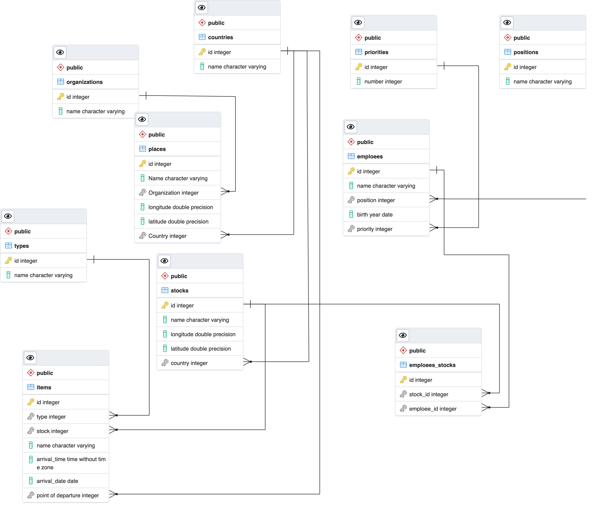

# Курсовая работа 
#### По дисциплине "Базы данных"

---
### Задание📄:
Разработать базу данных «Склад хранения», содержащую не менее 7 таблиц. В основной таблице должно содержаться не менее 100 тыс. записей, в других таблицах должно содержаться не менее 10 записей. В БД должно быть разработано не менее 5 сложных запросов и не менее 2 сложных отчетов.

---
### Установка⚙️
В первую очередь необходимо клонировать данный репозиторий через команду `git clone https://github.com/Artemidividiy/db-course.git`. Открываем vs code в папке и запускаем **init.sh**. Радуемся жизни.

---
### Работа      
После успешной установки получаем такую вот прекрасную бабочку

#### Отчеты и запросы:
***wip***. Работа будет в скором времени закончена.
### Заполнение
| название        | описание                                                                                                                                      | количество записей |
|-----------------|-----------------------------------------------------------------------------------------------------------------------------------------------|--------------------|
| countries       | Таблица со странами, необходимая для места нахождения склада, для страны-отправителя на данный склад предмета и определение места отправления | 20                 |
| emploees        | Таблица с данными о сотрудниках, их базовых данных, должности и  месте в корпоративной иерархии                                               | 1000               |
| emploees-stocks | Таблица, реализующая M2M отношение между сотрудниками и складами                                                                              | 1000               |
| items           | Таблица с грузами, находящимися на складах в данный момент                                                                                    | 10.000             |
| organizations   | Таблица с организациями, работающими со складами                                                                                              | 30                 |
| places          | Таблица с местами-отправителями                                                                                                               | 40                 |
| positions       | Таблица с должностями сотрудников                                                                                                             | 15                 |
| priorities      | Таблица со значениями иерархических мест сотрудников                                                                                          | 20                 |
| stocks          | Таблица со складами                                                                                                                           | 1000               |
| types           | Таблица с типами товаров на складах                                                                                                           | 28                 |